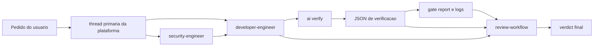

# Agents Directory

This directory contains the operational framework for AI agents in the project.

## Documentation Boundary

- `AGENTS.md` is the global repo manual: product context, code navigation, architecture maps, technical invariants, and the canonical execution policy (process, safety, autonomy, validation) under its `Execution Policy` section.
- `.agents/README.md` is the framework manual: agent ownership, prompts, manifests, workflows, mirrors, and local runtime policies.

## Structure

- `../AGENTS.md`: Manual global do repo para contexto do produto, mapas de arquitetura, invariantes do sistema e a policy canonica de execucao (secao `Execution Policy`).
- `agents/`: Subagents invocáveis. Cada agent tem um prompt autocontido em `*.agent.md` com Identity, Can Do, Cannot Do e Done When.
- `skills/`: Capacidades reutilizáveis acionáveis, cada uma com metadata canônica em `SKILL.md`.
- `runtime/`: Suporte compartilhado de execução que não é skill disparável, como o runtime do protocolo `review-workflow` e seus artefatos auxiliares.
- `verification-harness.md`: Guia amplo do runtime de validacao `ai:verify`, mantido fora da skill para evitar acoplamento da documentacao sistemica ao owner local.
- `workflows/`: Comandos e workflows invocáveis pelo usuário (slash commands) e rotinas padronizadas.
- `fixtures/`: Cenários estáticos, estáveis de teste e demonstração versionada.
- `sessions/`: Runtime local temporário, gerado por testes ou execuções. Não é considerado fonte de verdade.

## Active Agents

| agent                | papel principal                      | entra quando                                                           |
| -------------------- | ------------------------------------ | ---------------------------------------------------------------------- |
| `developer-engineer` | implementa e integra codigo          | feature, bugfix, refactor e remediacao                                 |
| `security-engineer`  | faz julgamento terminal de seguranca | existe toque material de auth, permissao, secrets ou boundary sensivel |

## Quick Start

Se voce so quer se orientar rapido:

1. Quer implementar: pense em `developer-engineer`.
2. Quer planejar antes: use o modo de planejamento nativo da plataforma
   (Plan Mode ou equivalente) antes de acionar o `developer-engineer`.
3. Quer revisar entrega: use `developer-engineer` com a skill `review-workflow`.
4. Quer validar diff de forma deterministica: rode `npm run ai:verify`.
5. Se nao estiver claro quem deveria assumir, a thread primaria da plataforma decide o fluxo e delega ao owner certo.

## How The Agents Work Together

O sistema agora é mais simples que a geração anterior: validação determinística não sai de um agent dedicado. Ela sai do harness `ai:verify`.



Fallback texto:

```text
pedido
  -> thread primaria escolhe o owner
       -> developer-engineer
       -> security-engineer

developer-engineer
  -> ai:verify
  -> JSON de verificacao
  -> gate report e logs
  -> review-workflow
  -> verdict final
```

Em termos práticos:

- A thread primaria da plataforma organiza ownership; nao ha agent coordenador separado.
- `developer-engineer` e o owner normal de entrega e do closeout de review quando solicitado.
- `ai:verify` faz a validacao mecanica.
- `review-workflow` fecha a leitura humana do diff e dos artifacts como skill, nao como agente separado.
- `security-engineer` entra por tipo de risco, nao por burocracia.

## Verification Harness

O harness operacional do caminho comum é `npm run ai:verify`.

- O harness decide `effectiveProfile`, gates e escalonamentos a partir do diff.
- `--dry-run` explica o que seria rodado sem executar os comandos.
- `--session-dir` persiste `gate-report` canônico para o `review-workflow` consumir depois.
- O unico entrypoint operacional suportado e `npm run ai:verify`.

Perfis disponíveis:

- `quick`: docs/config e validação rápida.
- `standard`: caminho comum de código de baixo ou médio risco.
- `high-risk`: contratos públicos, store global, infra de agents e refactors amplos.
- `ui-flow`: mudanças de UI com possibilidade de E2E advisory.
- `security-touch`: auth, API compartilhada e outros toques sensíveis.

O guia amplo do harness fica em [verification-harness.md](./verification-harness.md). A skill `lint-and-validate` fica com instrucao curta de uso e exemplos.

## Reading Order

Se você quer entender o sistema sem abrir o repo inteiro, esta ordem costuma bastar:

1. `AGENTS.md`
2. `.agents/README.md`
3. `.agents/verification-harness.md`
4. `.agents/agents/developer-engineer.agent.md`
5. `.agents/skills/review-workflow/SKILL.md`

## Policies

### Policy Source

- `AGENTS.md` (secao `Execution Policy`) é a fonte de verdade para processo, seguranca operacional, autonomia e defaults globais de execucao.
- `Codex`, `Copilot` e `Claude` consomem `AGENTS.md` diretamente como contexto global; nao ha policy espelhada em outro formato.

### Prompt and Mirror

- O prompt `*.agent.md` e autocontido: guarda `Identity`, `Can Do`, `Cannot Do` e `Done When`.
- Use `python3 .agents/scripts/sync-config-agents.py` para gerar todos os espelhos de agents a partir de `.agents/agents/`: `.claude/agents/*.md` (frontmatter minimo, sem `tools`), `.github/agents/*.agent.md` (frontmatter completo), `.codex/agents/*.toml` e o bloco `agent` de `opencode.json` (prompt compilado inline). Com `--check`, detecta drift sem escrever.
- Cada espelho aplica o packaging da sua plataforma (nome de arquivo, campos de frontmatter, dialeto de tools); o nucleo semantico e identico e vem do mesmo source.
- O roteamento de skills e feito pelo harness de cada plataforma, que injeta automaticamente as descriptions das skills no contexto do agente.

### Scripts, Templates and Schemas

- Assets auxiliares (`scripts/`, `templates/`, `schemas/`, `data/`) devem viver preferencialmente dentro do diretório da `skill` dona para garantir encapsulamento e governança explícita.
- Validação técnica determinística do caminho comum deve passar pelo harness `npm run ai:verify`; não existe agente dedicado de validação no runtime ativo.
- Para OpenSpec/OPSX, `.agents/workflows/` é a fonte canônica do lifecycle; a skill `openspec-workflow` serve para roteamento e guardrails, sem duplicar os passos completos dos prompts.

### Espelhos

- `.github/` e `.opencode/` contêm espelhos de workflows/prompts. Ao atualizar um workflow em `.agents/workflows/`, seu espelho deve ser atualizado para evitar divergências.
- Use `python3 .agents/scripts/sync-workflows.py` para sincronizar `.agents/workflows/` em `.github/prompts/` e `.opencode/commands/`.
- Agents sincronizados a partir de `.agents/agents/` devem permanecer locais ao repositório: `.claude/agents/`, `.github/agents/`, `opencode.json` e `.codex/agents/`.
