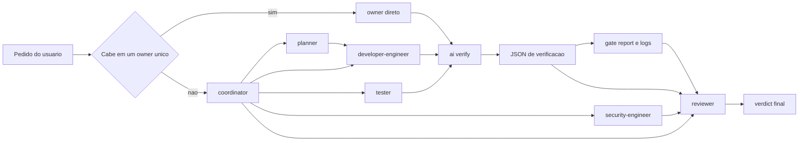

# Agents Directory

This directory contains the operational framework for AI agents in the project.

## Documentation Boundary

- `AGENTS.md` is the global repo manual: product context, code navigation, architecture maps, and technical invariants of the system.
- `.agents/rules/*.md` is the canonical policy pack for process, safety, autonomy, repo-wide execution defaults, validation, and Definition of Done.
- `.agents/README.md` is the framework manual: agent ownership, prompts, manifests, workflows, mirrors, and local runtime policies.
- Read `AGENTS.md` first for product context. Read `.agents/rules/*.md` for execution policy. Read this file when the task touches the agent framework itself.

## Structure

- `../AGENTS.md`: Manual global do repo para contexto do produto, mapas de arquitetura e invariantes do sistema.
- `rules/`: Policy pack canonico de processo, seguranca operacional, autonomia e defaults globais de execucao.
- `agents/`: Subagents invocáveis. Cada agent tem um prompt curto em `*.agent.md` e um contrato declarativo em `*.manifest.json`.
- `skills/`: Capacidades reutilizáveis acionáveis, cada uma com metadata canônica em `SKILL.md`.
- `runtime/`: Suporte compartilhado de execução que não é skill disparável, como o runtime do reviewer e seus artefatos auxiliares.
- `verification-harness.md`: Guia amplo do runtime de validacao `ai:verify`, mantido fora da skill para evitar acoplamento da documentacao sistemica ao owner local.
- `workflows/`: Comandos e workflows invocáveis pelo usuário (slash commands) e rotinas padronizadas.
- `fixtures/`: Cenários estáticos, estáveis de teste e demonstração versionada.
- `sessions/`: Runtime local temporário, gerado por testes ou execuções. Não é considerado fonte de verdade.

## Active Agents

| agent                | papel principal                      | entra quando                                                           |
| -------------------- | ------------------------------------ | ---------------------------------------------------------------------- |
| `coordinator`        | coordena owners e decide fluxo       | o pedido nao cabe claramente em um owner unico                         |
| `developer-engineer` | implementa e integra codigo          | feature, bugfix, refactor e remediacao                                 |
| `planner`            | produz plano executavel              | ainda faltam decisoes de abordagem ou escopo                           |
| `reviewer`           | fecha veredito com base em artifacts | a mudanca precisa de review final                                      |
| `tester`             | amplia cobertura e valida regressao  | testes saem do trivial ou precisam de owner dedicado                   |
| `security-engineer`  | faz julgamento terminal de seguranca | existe toque material de auth, permissao, secrets ou boundary sensivel |

## Quick Start

Se voce so quer se orientar rapido:

1. Quer implementar: pense em `developer-engineer`.
2. Quer planejar antes: pense em `planner`.
3. Quer revisar entrega: pense em `reviewer`.
4. Quer validar diff de forma deterministica: rode `npm run ai:verify`.
5. Se nao estiver claro quem deveria assumir, o `coordinator` decide o fluxo.

## How The Agents Work Together

O sistema agora é mais simples que a geração anterior: validação determinística não sai de um agent dedicado. Ela sai do harness `ai:verify`.



Fallback texto:

```text
pedido
  -> owner direto
  -> ou coordinator

coordinator
  -> planner
  -> developer-engineer
  -> tester
  -> security-engineer
  -> reviewer

developer-engineer / tester / owner direto
  -> ai:verify
  -> JSON de verificacao
  -> gate report e logs
  -> reviewer
  -> verdict final
```

Em termos práticos:

- `coordinator` nao implementa nem revisa; ele organiza ownership.
- `developer-engineer` e o owner normal de entrega.
- `ai:verify` faz a validacao mecanica.
- `reviewer` fecha a leitura humana do diff e dos artifacts.
- `tester` e `security-engineer` entram por tipo de risco, nao por burocracia.

## Verification Harness

O harness operacional do caminho comum é `npm run ai:verify`.

- O harness decide `effectiveProfile`, gates e escalonamentos a partir do diff.
- `--dry-run` explica o que seria rodado sem executar os comandos.
- `--session-dir` persiste `gate-report` canônico para o reviewer consumir depois.
- O unico entrypoint operacional suportado e `npm run ai:verify`.

Perfis disponíveis:

- `quick`: docs/config e validação rápida.
- `standard`: caminho comum de código de baixo ou médio risco.
- `high-risk`: contratos públicos, store global, infra de agents e refactors amplos.
- `ui-flow`: mudanças de UI com possibilidade de E2E advisory.
- `security-touch`: auth, API compartilhada e outros toques sensíveis.

O guia amplo do harness fica em [verification-harness.md](./verification-harness.md). A skill `lint-and-validate` fica com instrucao curta de uso e exemplos.

## Reading Order

Se você quer entender o sistema sem abrir o repo inteiro, esta ordem costuma bastar:

1. `AGENTS.md`
2. `.agents/rules/GLOBAL_RULE.md`
3. `.agents/README.md`
4. `.agents/verification-harness.md`
5. `.agents/agents/coordinator.agent.md`
6. `.agents/agents/developer-engineer.agent.md`
7. `.agents/agents/reviewer.agent.md`

## Policies

### Rules and Mirrors

- `.agents/rules/*.md` é a fonte de verdade para processo, seguranca operacional, autonomia e defaults globais de execucao.
- `.github/instructions/*.instructions.md` sao espelhos gerados dessas `rules` para GitHub/Copilot.
- Use `python3 .agents/scripts/sync-instructions-rules.py` para sincronizar os espelhos e `python3 .agents/scripts/sync-instructions-rules.py --check` para detectar drift.
- `opencode.json` aponta para as `rules` canonicas diretamente; nao troque isso pelos espelhos.
- `AGENTS.md` nao tem espelho derivado. Ele continua sendo o manual global do projeto.

### Prompt, Manifest and Mirror

- O contrato interno do agent fica em `*.manifest.json`.
- O manifest e a fonte canonica dos `routing_checklist` e `escalation_checklist`.
- O comportamento humano do agent fica no prompt curto `*.agent.md`, que deve espelhar essas regras nas secoes `Routing Checklist` e `Escalation Checklist`.
- O espelho para Codex fica em `.codex/agents/*.toml` e deve ser sincronizado com `python3 .agents/scripts/sync-codex-agents.py`.
- `Codex` usa `AGENTS.md` como contexto global do projeto e `.codex/agents/*.toml` como espelho dos prompts de agents; nao existe espelho de `rules` para Codex nesta arquitetura.
- Nesta fase nao existe automacao de abertura de skill; o checklist governa a decisao cognitiva do agent, nao um runtime executavel novo.

### Scripts, Templates and Schemas

- Assets auxiliares (`scripts/`, `templates/`, `schemas/`, `data/`) devem viver preferencialmente dentro do diretório da `skill` dona para garantir encapsulamento e governança explícita.
- Validação técnica determinística do caminho comum deve passar pelo harness `npm run ai:verify`; não existe agente dedicado de validação no runtime ativo.
- Para OpenSpec/OPSX, `.agents/workflows/` é a fonte canônica do lifecycle; a skill `openspec-workflow` serve para roteamento e guardrails, sem duplicar os passos completos dos prompts.

### Espelhos

- `.github/` e `.opencode/` contêm espelhos de workflows/prompts. Ao atualizar um workflow em `.agents/workflows/`, seu espelho deve ser atualizado para evitar divergências.
- `.claude/` contém os espelhos para Claude Code:
  - `.claude/agents/` — gerado por `sync-config-agents.py` a partir de `.agents/agents/*.agent.md`. Um arquivo por agent, com frontmatter Claude Code e body canônico.
  - `.claude/skills/` — symlink direto para `.agents/skills/`. Zero duplicação; qualquer skill nova em `.agents/skills/` fica disponível automaticamente no Claude Code.
  - `.claude/commands/` — gerado por `sync-workflows.py` a partir de `.agents/workflows/`. Workflows viram slash commands invocáveis no Claude Code.
  - `CLAUDE.md` (raiz do repo) — importa `AGENTS.md`, `GLOBAL_RULE.md` e `skill-index.md` via `@import`. Não tem conteúdo próprio.
