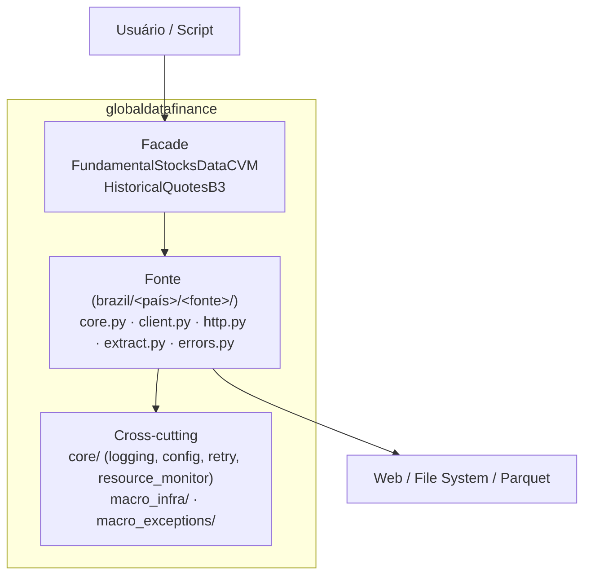

# 📊 Global-Data-Finance

<div align="center">

**Biblioteca Python profissional para extração e processamento de dados financeiros globais com arquitetura limpa e alto desempenho.**

[](https://www.python.org/downloads/)
[](https://pypi.org/project/globaldatafinance/)
[](https://github.com/jor0105/Global-Data-Finance/blob/develop/LICENSE)
[](https://github.com/psf/black)
[](http://mypy-lang.org/)

[Documentação Oficial](https://jor0105.github.io/Global-Data-Finance/) • [Instalação](#-instalação) • [Quick Start](#-quick-start) • [API Reference](#-api-reference) • [Contribuir](#-contribuindo)

</div>

---

## 🎯 Sobre

**Global-Data-Finance** é uma solução robusta e de alto desempenho para engenharia de dados financeiros. Projetada para desenvolvedores, cientistas de dados e analistas quantitativos, a biblioteca abstrai a complexidade de extrair e normalizar dados de fontes regulatórias (CVM) e de mercado (B3).

A API pública é deliberadamente estreita (apenas duas classes: `FundamentalStocksDataCVM` e `HistoricalQuotesB3`), e cada fonte de dados é implementada internamente em um **layout plano de módulos nomeados por papel** (`core.py`, `client.py`, `http.py`, `extract.py`, `errors.py`). O resultado é código direto, fácil de ler e fácil de estender com uma nova fonte.

### 🌟 Por que escolher Global-Data-Finance?

- **🚀 Performance**: Downloads assíncronos com `httpx[http2]`, retry/back-off exponencial próprio (`core/utils/retry_strategy.py`) e concorrência adaptativa monitorada por CPU/RAM (`psutil`).
- **🛡️ Robustez**: Validação de integridade após download, rollback atômico na extração e defesa contra path-traversal em paths sensíveis.
- **💾 Formato Colunar**: Saída canônica em **Parquet** (via `pyarrow`), pronto para Pandas/Polars.
- **🧩 Layout Plano por Fonte**: Adicionar uma fonte = criar uma pasta-irmã com 5–8 arquivos nomeados por papel. Sem cerimônia de Clean Architecture, sem ABCs sem polimorfismo real.
- **✨ Developer Experience**: Type hints completos, logging estruturado, markers de teste estritos (`unit`, `integration`, `slow`, `asyncio`).

---

## ✨ Funcionalidades

### 📈 Fontes de Dados Suportadas

| Fonte   | Tipo de Dado            | Detalhes                                  | Status      |
| :------ | :---------------------- | :---------------------------------------- | :---------- |
| **CVM** | Documentos Regulatórios | DFP, ITR, FRE, FCA, CGVN, VLMO, IPE       | ✅ Produção |
| **B3**  | Cotações Históricas     | Ações, ETFs, BDRs, Opções, Termo, Futuros | ✅ Produção |

### ⚙️ Destaques Técnicos

- **Download Manager Assimétrico**:
  - Gerenciamento automático de concorrência.
  - Backoff exponencial para falhas de rede.
  - Validação de integridade de arquivos (ZIP/MD5).
- **Processamento de Cotações (B3)**:
  - Parser otimizado para arquivos posicionais legados.
  - Modos de execução: `fast` (in-memory) e `slow` (low-memory).
  - Filtragem avançada por tipo de ativo (Ações, Opções, etc.).

---

## 🚀 Instalação

Requer **Python 3.12+**.

### Via Pip (consumir como dependência)

```bash
pip install globaldatafinance
```

### Via uv (desenvolvimento)

`uv` é o gestor canônico do projeto. Para hackear localmente:

```bash
git clone https://github.com/jor0105/Global-Data-Finance.git
cd Global-Data-Finance
uv sync                       # cria .venv e instala todas as deps + dev deps
uv run pytest                 # testes
uv run pre-commit run --all-files  # lint + typecheck + bandit + etc.
```

---

## 💡 Quick Start

### 1. Dados Fundamentais (CVM)

Baixe demonstrações financeiras (DFP, ITR) e formulários de referência de forma massiva e resiliente.

```python
from globaldatafinance import FundamentalStocksDataCVM
import logging

# (Opcional) Configurar logging para ver o progresso detalhado
logging.basicConfig(level=logging.INFO)

# Inicializar cliente
cvm = FundamentalStocksDataCVM()

# Baixar e extrair automaticamente para Parquet
cvm.download(
    destination_path="./dados_cvm",
    list_docs=["DFP", "ITR"],    # Tipos de documentos
    initial_year=2023,           # Ano inicial
    last_year=2024,              # Ano final
    automatic_extractor=True     # Converte ZIP -> Parquet
)
```

### 2. Cotações Históricas (B3)

Processe a série histórica da B3, transformando arquivos de texto complexos em DataFrames prontos para análise.

```python
from globaldatafinance import HistoricalQuotesB3

# Inicializar cliente
b3 = HistoricalQuotesB3()

# Extrair cotações de Ações e ETFs
result = b3.extract(
    path_of_docs="./dados_brutos_b3",  # Onde estão os ZIPs da B3 (COTAHIST_A2023.ZIP)
    destination_path="./dados_processados",
    assets_list=["ações", "etf"],
    initial_year=2023,
    processing_mode="fast"  # Modo otimizado
)

print(f"Processamento concluído! Registros extraídos: {result['total_records']:,}")
print(f"Arquivo salvo em: {result['output_file']}")
```

### 3. Analisando os Dados

Os dados são salvos em formato **Parquet**, ideal para análise com Pandas ou Polars.

```python
import pandas as pd

# Ler o arquivo gerado
df = pd.read_parquet("./dados_processados/cotahist_extracted.parquet")

# Analisar
print(df.head())
print(df.groupby("cod_negociacao")["preco_fechamento"].mean())
```

---

## 🏗️ Arquitetura

Duas camadas explícitas:

1. **Facade público (`application/`)** — superfície semver-relevante. Cada fonte é exposta por uma classe top-level (`FundamentalStocksDataCVM`, `HistoricalQuotesB3`) e um formatter dedicado.
2. **Implementação por fonte (`brazil/<país>/<fonte>/`)** — layout plano de módulos nomeados por papel.



### Estrutura de Diretórios

```text
src/
└── globaldatafinance/
    ├── application/                       # Facade público
    │   ├── cvm_docs/fundamental_stocks_data.py
    │   └── b3_docs/historical_quotes.py
    ├── brazil/
    │   ├── cvm/
    │   │   └── fundamental_stocks_data/   # ~5 módulos planos
    │   │       ├── core.py
    │   │       ├── client.py
    │   │       ├── http.py
    │   │       ├── extract.py
    │   │       └── errors.py
    │   └── b3_data/
    │       └── historical_quotes/         # ~7–8 módulos planos
    │           ├── core.py · client.py · zip_reader.py · errors.py
    │           ├── cotahist_parser.py
    │           ├── parquet_writer/        # subpacote (writer/schema/streaming/...)
    │           └── extraction_service/    # subpacote (service/batch_parser/...)
    ├── core/                              # logging, config, retry, resource monitor
    ├── macro_infra/                       # adapters HTTP/IO genéricos
    └── macro_exceptions/                  # exceções de base
```

Detalhes em [`docs/dev-guide/architecture.md`](docs/dev-guide/architecture.md) e [`AGENTS.md`](AGENTS.md).

---

## 📊 API Reference

### `FundamentalStocksDataCVM`

Gerenciador de downloads de documentos da CVM.

| Método                    | Assinatura                                                                                                                                 | Descrição                                                     |
| :------------------------ | :----------------------------------------------------------------------------------------------------------------------------------------- | :------------------------------------------------------------ |
| **`download`**            | `(destination_path: str, list_docs: list[str]=None, initial_year: int=None, last_year: int=None, automatic_extractor: bool=False) -> None` | Realiza o download e opcionalmente a extração dos documentos. |
| **`get_available_docs`**  | `() -> dict`                                                                                                                               | Retorna lista de documentos disponíveis e suas descrições.    |
| **`get_available_years`** | `() -> dict`                                                                                                                               | Retorna o intervalo de anos disponíveis para download.        |

### `HistoricalQuotesB3`

Extrator de cotações históricas da B3.

| Método                     | Assinatura                                                                                                                                                                                             | Descrição                                                          |
| :------------------------- | :----------------------------------------------------------------------------------------------------------------------------------------------------------------------------------------------------- | :----------------------------------------------------------------- |
| **`extract`**              | `(path_of_docs: str, assets_list: list[str], initial_year: int=None, last_year: int=None, destination_path: str=None, output_filename: str="cotahist_extracted", processing_mode: str="fast") -> dict` | Processa arquivos ZIP da B3 e gera um arquivo Parquet consolidado. |
| **`get_available_assets`** | `() -> list[str]`                                                                                                                                                                                      | Retorna tipos de ativos suportados (ex: 'ações', 'opções').        |
| **`get_available_years`**  | `() -> dict`                                                                                                                                                                                           | Retorna o intervalo de anos disponíveis para os dados históricos.  |

---

## 🤝 Contribuindo

Contribuições são muito bem-vindas! Se você deseja adicionar novas fontes de dados, melhorar a performance ou corrigir bugs:

1.  **Fork** o projeto.
2.  Crie uma branch para sua feature (`git checkout -b feature/nova-feature`).
3.  Implemente suas mudanças.
4.  Execute os testes e linters:
    ```bash
    uv run pre-commit run --all-files
    uv run pytest
    ```
5.  Abra um **Pull Request**.

Consulte o [Guia de Contribuição](https://jor0105.github.io/Global-Data-Finance/dev-guide/contributing/) para mais detalhes.

---

## 📄 Licença

Este projeto é distribuído sob a licença **Apache 2.0**. Consulte o arquivo [LICENSE](LICENSE) para mais informações.

---

## 📞 Suporte e Contato

- **Autor**: Jordan Estralioto
- **GitHub**: [@jor0105](https://github.com/jor0105)
- **Email**: estraliotojordan@gmail.com
- **Issues**: [Reportar Bug](https://github.com/jor0105/Global-Data-Finance/issues)

---

<div align="center">
    <sub>Copyright © 2025 Jordan Estralioto • Licensed under Apache 2.0</sub>
</div>
