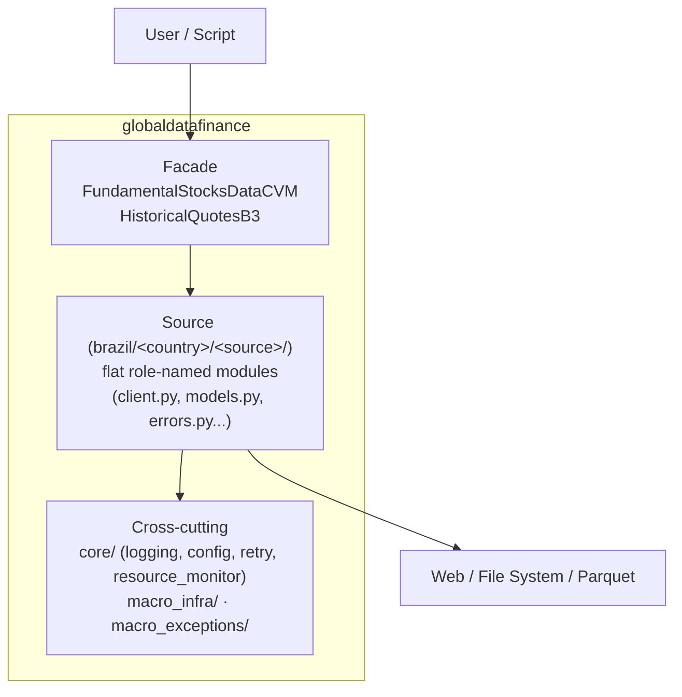

# 📊 Global-Data-Finance

<div align="center">

**Professional Python library for extracting and processing global financial data with a flat source layout, high performance, and extensible tools.**

[](https://www.python.org/downloads/)
[](https://pypi.org/project/globaldatafinance/)
[](https://github.com/jordanestralioto/Global-Data-Finance/blob/develop/LICENSE)
[](https://github.com/astral-sh/ruff)
[](http://mypy-lang.org/)

[Official Documentation](https://jordanestralioto.github.io/Global-Data-Finance/) • [Installation](#-installation) • [Quick Start](#-quick-start) • [API Reference](#-api-reference) • [Contributing](#-contributing)

</div>

______________________________________________________________________

## 🎯 About

**Global-Data-Finance** is a robust, high-performance solution for financial data engineering. Designed for developers, data scientists, and quantitative analysts, the library abstracts the complexity of extracting and normalizing data from regulatory (CVM) and market (B3) sources.

The public API is deliberately narrow (re-exporting `FundamentalStocksDataCVM` and `HistoricalQuotesB3` at the root, along with the `ExtractionResultB3` type), and each data source is implemented internally in a **flat layout of role-named modules** (`core.py` (or granular models), `client.py`, `http.py`, `extract.py`, `errors.py`). The result is straightforward, easy-to-read code that is easy to extend with a new data source.

### 🌟 Why Choose Global-Data-Finance?

- **🚀 Performance**: Async downloads with `httpx[http2]`, custom exponential retry/backoff (`core/utils/retry_strategy.py`), and adaptive concurrency monitored by CPU/RAM (`psutil`).
- **🛡️ Robustness**: Integrity validation after download, atomic rollback during extraction, and path-traversal defense for sensitive paths.
- **💾 Columnar Format**: Canonical output in **Parquet** (via `pyarrow`), ready for Pandas/Polars.
- **🧩 Flat Layout per Source**: Adding a data source simply requires creating a dedicated directory with role-named modules (e.g., client, models, http, extract), resulting in intuitive, modular, and directly maintainable code.
- **✨ Developer Experience**: Complete type hints, structured logging, strict test markers (`unit`, `integration`, `slow`, `asyncio`).

______________________________________________________________________

## ✨ Features

### 📈 Supported Data Sources

| Source  | Data Type            | Details                                       | Status        |
| :------ | :------------------- | :-------------------------------------------- | :------------ |
| **CVM** | Regulatory Documents | DFP, ITR, FRE, FCA, CGVN, VLMO, IPE           | ✅ Production |
| **B3**  | Historical Quotes    | Stocks, ETFs, BDRs, Options, Forward, Futures | ✅ Production |

### ⚙️ Technical Highlights

- **Asymmetric Download Manager**:
  - Automatic concurrency management.
  - Exponential backoff for network failures.
  - File integrity validation (ZIP/MD5).
- **Quotes Processing (B3)**:
  - Optimized parser for legacy positional files.
  - Execution modes: `fast` (in-memory) and `slow` (low-memory).
  - Advanced filtering by asset type (Stocks, Options, etc.).

______________________________________________________________________

## 📊 Measured Performance Baseline

Real-scale measurement on **2026-08-06** (Python 3.13.7, 8 CPUs, 7.55 GB RAM,
no network calls), processing 17 official COTAHIST ZIPs (2008-2024), all asset
types:

| Mode                                               |                  Written rows |    Peak RSS |   Time |
| :------------------------------------------------- | ----------------------------: | ----------: | -----: |
| **B3 `fast`**                                      |                    15,059,876 | 4,259.35 MB | 20m22s |
| **B3 `slow`**                                      |                    15,059,876 | 1,570.54 MB | 29m19s |
| **CVM (All Docs, 2010-2024)** (download + Parquet) | 63,300,208 rows (1,392 files) |   459.18 MB |  8m25s |

Reproducible synthetic baseline (250,000 records, 3 runs each, same machine):

| Mode   | API time (median) |    Peak RSS | Throughput (median) |
| :----- | ----------------: | ----------: | ------------------: |
| `fast` |           11.15 s | 1,111.72 MB |    22,427 records/s |
| `slow` |           18.05 s | 1,103.01 MB |    13,847 records/s |

See the full [benchmark methodology and reproduction guide](docs/dev-guide/benchmarks.md).

______________________________________________________________________

## 🚀 Installation

Requires **Python 3.12+**.

### Via Pip (consume as dependency)

```bash
pip install globaldatafinance
```

### Via uv (development)

`uv` is the canonical package manager for the project. To hack locally:

```bash
git clone https://github.com/jordanestralioto/Global-Data-Finance.git
cd Global-Data-Finance
uv sync --locked --all-extras --dev
uv run --locked --no-sync pytest
uv run --locked --no-sync pre-commit install --install-hooks
uv run --locked --no-sync pre-commit run --all-files --show-diff-on-failure
```

______________________________________________________________________

## 💡 Quick Start

### 1. Fundamental Data (CVM)

Download financial statements (DFP, ITR) and reference forms in a massive and resilient way.

```python
from globaldatafinance import FundamentalStocksDataCVM
import logging

# (Optional) Configure logging to view detailed progress
logging.basicConfig(level=logging.INFO)

# Initialize client
cvm = FundamentalStocksDataCVM()

# Download and automatically extract to Parquet
result = cvm.download(
    destination_path="./dados_cvm",
    list_docs=["DFP", "ITR"],    # Document types
    initial_year=2023,           # Start year
    last_year=2024,              # End year
    automatic_extractor=True     # Converts ZIP -> Parquet
)
print(f"Successful downloads: {result.success_count_downloads}")
```

### 2. Historical Quotes (B3)

Process B3 historical series, transforming complex text files into analysis-ready DataFrames.

```python
from globaldatafinance import HistoricalQuotesB3

# Initialize client
b3 = HistoricalQuotesB3()

# Extract Stock and ETF quotes
result = b3.extract(
    path_of_docs="./dados_brutos_b3",  # Where B3 ZIP files are located (COTAHIST_A2023.ZIP)
    destination_path="./dados_processados",
    assets_list=["ações", "etf"],
    initial_year=2023,
    processing_mode="fast"  # Optimized mode
)

print(f"Processing completed! Extracted records: {result['total_records']:,}")
print(f"File saved at: {result['output_file']}")
```

### 3. Analyzing Data

Data is saved in **Parquet** format, ideal for analysis with Pandas or Polars.

```python
import pandas as pd

# Read generated file
df = pd.read_parquet("./dados_processados/cotahist_extracted.parquet")

# Analyze
print(df.head())
print(df.groupby("cod_negociacao")["preco_fechamento"].mean())
```

______________________________________________________________________

## 🏗️ Architecture

Two explicit layers:

1. **Public Facade (`application/`)** — SemVer-relevant surface. Each source is exposed by a top-level class (`FundamentalStocksDataCVM`, `HistoricalQuotesB3`) and a dedicated formatter.
2. **Implementation per Source (`brazil/<country>/<source>/`)** — flat layout of role-named modules.



### Directory Structure

```text
src/
└── globaldatafinance/
    ├── application/                       # Public facade
    │   ├── cvm_docs/fundamental_stocks_data.py
    │   └── b3_docs/historical_quotes.py
    ├── brazil/
    │   ├── cvm/
    │   │   └── fundamental_stocks_data/   # ~7 flat modules
    │   │       ├── core.py · client.py · errors.py
    │   │       ├── http.py · extract.py
    │   │       └── download_validation.py · download_extraction.py
    │   └── b3_data/
    │       └── historical_quotes/         # ~11 flat modules
    │           ├── models.py · filesystem.py · assets.py · processing.py · years.py
    │           ├── client.py · zip_reader.py · errors.py
    │           ├── cotahist_parser.py
    │           ├── parquet_writer/        # subpackage (writer/schema/streaming/...)
    │           └── extraction_service/    # subpackage (service/batch_parser/...)
    ├── core/                              # logging, config, retry, resource monitor
    ├── macro_infra/                       # generic HTTP/IO adapters
    └── macro_exceptions/                  # base exceptions
```

Details in [`docs/dev-guide/architecture.md`](docs/dev-guide/architecture.md) and [`AGENTS.md`](AGENTS.md).

______________________________________________________________________

## 📊 API Reference

### `FundamentalStocksDataCVM`

Manager for downloading CVM documents.

| Method                    | Signature                                                                                                                                               | Description                                                 |
| :------------------------ | :------------------------------------------------------------------------------------------------------------------------------------------------------ | :---------------------------------------------------------- |
| **`download`**            | `(destination_path: str, list_docs: list[str]=None, initial_year: int=None, last_year: int=None, automatic_extractor: bool=False) -> DownloadResultCVM` | Downloads and optionally extracts documents.                |
| **`async_download`**      | `(destination_path: str, list_docs: list[str]=None, initial_year: int=None, last_year: int=None, automatic_extractor: bool=False) -> DownloadResultCVM` | Asynchronous variant of `download`.                         |
| **`get_available_docs`**  | `() -> dict[str, str]`                                                                                                                                  | Returns list of available documents and their descriptions. |
| **`get_available_years`** | `() -> AvailableYearsInfoCVM`                                                                                                                           | Returns range of available years for download.              |

### `HistoricalQuotesB3`

Extractor for B3 historical quotes.

| Method                     | Signature                                                                                                                                                                                                                                | Description                                                       |
| :------------------------- | :--------------------------------------------------------------------------------------------------------------------------------------------------------------------------------------------------------------------------------------- | :---------------------------------------------------------------- |
| **`extract`**              | `(path_of_docs: str, assets_list: list[str], initial_year: int=None, last_year: int=None, destination_path: str=None, output_filename: str="cotahist_extracted", processing_mode: str="fast", verbose: bool=True) -> ExtractionResultB3` | Processes B3 ZIP files and generates a consolidated Parquet file. |
| **`extract_async`**        | `(path_of_docs: str, assets_list: list[str], initial_year: int=None, last_year: int=None, destination_path: str=None, output_filename: str="cotahist_extracted", processing_mode: str="fast", verbose: bool=True) -> ExtractionResultB3` | Asynchronous variant of `extract`.                                |
| **`get_available_assets`** | `() -> list[str]`                                                                                                                                                                                                                        | Returns supported asset types (e.g., 'ações', 'opções').          |
| **`get_available_years`**  | `() -> dict[str, int]`                                                                                                                                                                                                                   | Returns range of available years for historical data.             |

______________________________________________________________________

## 🤝 Contributing

Contributions are very welcome! If you wish to add new data sources, improve performance, or fix bugs:

1. **Fork** the repository.
2. Create a branch for your feature (`git checkout -b feature/new-feature`).
3. Implement your changes.
4. Run tests and linters:
   ```bash
   uv run --locked --no-sync pre-commit run --all-files --show-diff-on-failure
   uv run --locked --no-sync pytest
   ```
5. Open a **Pull Request**.

See the [Contributing Guide](https://jordanestralioto.github.io/Global-Data-Finance/dev-guide/contributing/) for more details.

______________________________________________________________________

## 📄 License

This project is distributed under the **Apache 2.0** license. See the [LICENSE](LICENSE) file for more information.

______________________________________________________________________

## 📞 Support and Contact

- **Author**: Jordan Estralioto
- **GitHub**: [@jordanestralioto](https://github.com/jordanestralioto)
- **Email**: estraliotojordan@gmail.com
- **Issues**: [Report Bug](https://github.com/jordanestralioto/Global-Data-Finance/issues)

______________________________________________________________________

<div align="center">
    <sub>Copyright © 2026 Jordan Estralioto • Licensed under Apache 2.0</sub>
</div>
