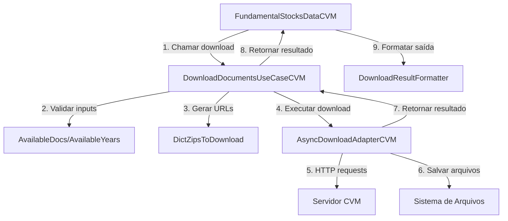
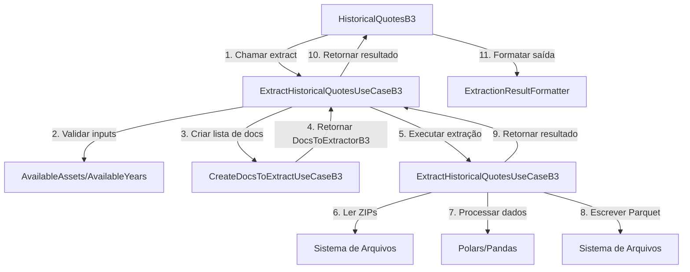

# Arquitetura

Documentação completa da arquitetura do Global-Data-Finance, padrões de design e estrutura do projeto.

---

## Visão Geral

O Global-Data-Finance é construído seguindo princípios de **Clean Architecture**, com separação clara entre camadas de domínio, aplicação e infraestrutura. Esta arquitetura garante:

- ✅ **Testabilidade**: Fácil criação de testes unitários e de integração
- ✅ **Manutenibilidade**: Código organizado e fácil de entender
- ✅ **Extensibilidade**: Simples adicionar novas funcionalidades
- ✅ **Independência**: Camadas desacopladas e independentes

---

## Estrutura do Projeto

```
globaldatafinance/
├── src/globaldatafinance/
│   ├── __init__.py
│   ├── application/          # Camada de aplicação (API pública)
│   │   ├── b3_docs/          # Interface B3
│   │   │   ├── historical_quotes.py
│   │   │   └── result_formatters/
│   │   └── cvm_docs/         # Interface CVM
│   │       ├── fundamental_stocks_data.py
│   │       └── result_formatters/
│   ├── brazil/               # Implementações específicas do Brasil
│   │   ├── b3_data/          # Dados B3
│   │   │   └── historical_quotes/
│   │   │       ├── domain/   # Entidades de domínio
│   │   │       ├── application/  # Casos de uso
│   │   │       ├── infra/    # Adapters e infraestrutura
│   │   │       └── exceptions/
│   │   └── cvm/              # Dados CVM
│   │       └── fundamental_stocks_data/
│   │           ├── domain/
│   │           ├── application/
│   │           ├── infra/
│   │           └── exceptions/
│   ├── core/                 # Utilitários e configuração
│   │   ├── logging_config.py
│   │   ├── config.py
│   │   └── utils/
│   ├── macro_exceptions/     # Exceções globais
│   └── macro_infra/          # Infraestrutura compartilhada
├── tests/                    # Testes
├── docs/                     # Documentação
├── examples/                 # Exemplos de uso
└── pyproject.toml           # Configuração do projeto
```

---

## Camadas da Arquitetura

### 1. Camada de Aplicação (`application/`)

**Responsabilidade**: Interface pública de alto nível para usuários finais.

**Componentes**:

- `FundamentalStocksDataCVM`: API para documentos CVM
- `HistoricalQuotesB3`: API para cotações B3
- Result formatters: Formatação de resultados para exibição

**Características**:

- API simples e intuitiva
- Abstrai complexidade interna
- Gerencia logging e formatação de saída

**Exemplo**:

```python
# application/cvm_docs/fundamental_stocks_data.py
class FundamentalStocksDataCVM:
    def __init__(self):
        self.download_adapter = AsyncDownloadAdapterCVM(...)
        self.__download_use_case = DownloadDocumentsUseCaseCVM(...)

    def download(self, destination_path, list_docs, ...):
        # Orquestra casos de uso e formata resultados
        result = self.__download_use_case.execute(...)
        self.__result_formatter.print_result(result)
```

### 2. Camada de Domínio (`domain/`)

**Responsabilidade**: Entidades de negócio e regras de domínio.

**Componentes**:

- Value Objects (ex: `DictZipsToDownload`, `DocsToExtractorB3`)
- Validadores (ex: `AvailableDocs`, `AvailableYears`)
- Entidades de resultado (ex: `DownloadResultCVM`)

**Características**:

- Sem dependências externas
- Lógica de negócio pura
- Imutabilidade quando possível

**Exemplo**:

```python
# brazil/cvm/fundamental_stocks_data/domain/available_docs.py
class AvailableDocs:
    DOCS_MAPPING = {
        "DFP": "Demonstração Financeira Padronizada",
        "ITR": "Informação Trimestral",
        # ...
    }

    def validate_docs_name(self, doc_name: str) -> None:
        if doc_name not in self.DOCS_MAPPING:
            raise InvalidDocName(f"Invalid document: {doc_name}")
```

### 3. Camada de Aplicação Interna (`application/`)

**Responsabilidade**: Casos de uso e orquestração de lógica de negócio.

**Componentes**:

- Use Cases (ex: `DownloadDocumentsUseCaseCVM`, `ExtractHistoricalQuotesUseCaseB3`)
- Interfaces/Repositories (ex: `DownloadDocsCVMRepository`)

**Características**:

- Orquestra operações complexas
- Define contratos (interfaces)
- Coordena domínio e infraestrutura

**Exemplo**:

```python
# brazil/cvm/fundamental_stocks_data/application/use_cases/download_documents.py
class DownloadDocumentsUseCaseCVM:
    def __init__(self, download_repository: DownloadDocsCVMRepository):
        self.__download_repository = download_repository

    def execute(self, destination_path, list_docs, ...):
        # Validar inputs
        # Gerar URLs
        # Delegar download para repository
        return self.__download_repository.download_docs(...)
```

### 4. Camada de Infraestrutura (`infra/`)

**Responsabilidade**: Implementações concretas de adapters e serviços externos.

**Componentes**:

- Adapters de download (ex: `AsyncDownloadAdapterCVM`, `Aria2cAdapter`)
- Adapters de extração (ex: `ParquetExtractorAdapterCVM`)
- Clientes HTTP, manipuladores de arquivos, etc.

**Características**:

- Implementa interfaces definidas na camada de aplicação
- Lida com detalhes técnicos (HTTP, I/O, etc.)
- Isolada do domínio

**Exemplo**:

```python
# brazil/cvm/fundamental_stocks_data/infra/adapters/async_download_adapter.py
class AsyncDownloadAdapterCVM(DownloadDocsCVMRepository):
    def download_docs(self, destination_path, dict_zip_to_download):
        # Implementação concreta usando httpx
        async with httpx.AsyncClient() as client:
            tasks = [self._download_file(url, ...) for url in urls]
            results = await asyncio.gather(*tasks)
        return DownloadResultCVM(...)
```

---

## Padrões de Design

### Repository Pattern

**Objetivo**: Abstrair acesso a dados e serviços externos.

**Implementação**:

```python
# Interface (application/interfaces/)
class DownloadDocsCVMRepository(ABC):
    @abstractmethod
    def download_docs(self, ...) -> DownloadResultCVM:
        pass

# Implementação concreta (infra/adapters/)
class AsyncDownloadAdapterCVM(DownloadDocsCVMRepository):
    def download_docs(self, ...) -> DownloadResultCVM:
        # Implementação real
        pass
```

**Benefícios**:

- Fácil troca de implementações
- Testabilidade (mocking)
- Desacoplamento

### Use Case Pattern

**Objetivo**: Encapsular lógica de negócio em casos de uso específicos.

**Implementação**:

```python
class DownloadDocumentsUseCaseCVM:
    def __init__(self, repository: DownloadDocsCVMRepository):
        self.__repository = repository

    def execute(self, ...):
        # Orquestrar operação
        pass
```

**Benefícios**:

- Lógica de negócio centralizada
- Reutilizável
- Testável

### Result Pattern

**Objetivo**: Encapsular resultados de operações com sucesso e erros.

**Implementação**:

```python
@dataclass
class DownloadResultCVM:
    success_count_downloads: int
    error_count_downloads: int
    successful_downloads: Dict[str, List[int]]
    failed_downloads: Dict[str, str]

    def has_errors(self) -> bool:
        return self.error_count_downloads > 0
```

**Benefícios**:

- Tratamento de erros explícito
- Informações detalhadas
- Type-safe

### Value Object Pattern

**Objetivo**: Objetos imutáveis que representam valores de domínio.

**Implementação**:

```python
class DictZipsToDownload:
    def get_dict_zips_to_download(self, list_docs, initial_year, last_year):
        # Gera estrutura imutável de URLs
        return {doc: [year1, year2, ...] for doc in list_docs}
```

**Benefícios**:

- Imutabilidade
- Validação encapsulada
- Reutilizável

---

## Fluxo de Dados

### Download de Documentos CVM



### Extração de Cotações B3



---

## Princípios SOLID

### Single Responsibility Principle (SRP)

Cada classe tem uma única responsabilidade:

- `FundamentalStocksDataCVM`: Interface pública
- `DownloadDocumentsUseCaseCVM`: Orquestração de download
- `AsyncDownloadAdapterCVM`: Implementação de download
- `AvailableDocs`: Validação de documentos

### Open/Closed Principle (OCP)

Aberto para extensão, fechado para modificação:

```python
# Fácil adicionar novo adapter sem modificar código existente
class NewDownloadAdapter(DownloadDocsCVMRepository):
    def download_docs(self, ...):
        # Nova implementação
        pass

# Uso
new_adapter = NewDownloadAdapter()
use_case = DownloadDocumentsUseCaseCVM(new_adapter)
```

### Liskov Substitution Principle (LSP)

Subtipos podem substituir tipos base:

```python
# Qualquer implementação de DownloadDocsCVMRepository pode ser usada
adapter: DownloadDocsCVMRepository = AsyncDownloadAdapterCVM()
# ou
adapter: DownloadDocsCVMRepository = Aria2cAdapter()
# ou
adapter: DownloadDocsCVMRepository = WgetDownloadAdapter()

use_case = DownloadDocumentsUseCaseCVM(adapter)
```

### Interface Segregation Principle (ISP)

Interfaces específicas e focadas:

```python
# Interface específica para download
class DownloadDocsCVMRepository(ABC):
    @abstractmethod
    def download_docs(self, ...) -> DownloadResultCVM:
        pass

# Interface específica para extração
class FileExtractorRepository(ABC):
    @abstractmethod
    def extract_to_parquet(self, ...) -> None:
        pass
```

### Dependency Inversion Principle (DIP)

Depender de abstrações, não de implementações:

```python
# Use case depende de interface, não de implementação concreta
class DownloadDocumentsUseCaseCVM:
    def __init__(self, repository: DownloadDocsCVMRepository):  # Abstração
        self.__repository = repository
```

---

## Extensibilidade

### Adicionar Novo Adapter de Download

1. Criar classe que implementa `DownloadDocsCVMRepository`:

```python
class MyCustomAdapter(DownloadDocsCVMRepository):
    def download_docs(self, destination_path, dict_zip_to_download):
        # Sua implementação
        return DownloadResultCVM(...)
```

2. Usar no use case:

```python
adapter = MyCustomAdapter()
use_case = DownloadDocumentsUseCaseCVM(adapter)
```

### Adicionar Nova Fonte de Dados

1. Criar estrutura de domínio
2. Criar use cases
3. Criar adapters
4. Criar interface pública em `application/`

---

## Próximos Passos

- 📖 **[Referência da API](api-reference.md)** - Documentação completa da API
- 🤝 **[Como Contribuir](contributing.md)** - Guia para contribuidores
- 🧪 **[Testes](testing.md)** - Como escrever e executar testes
- 🔧 **[Uso Avançado](advanced-usage.md)** - Customização e extensões
