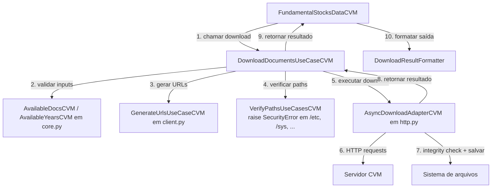
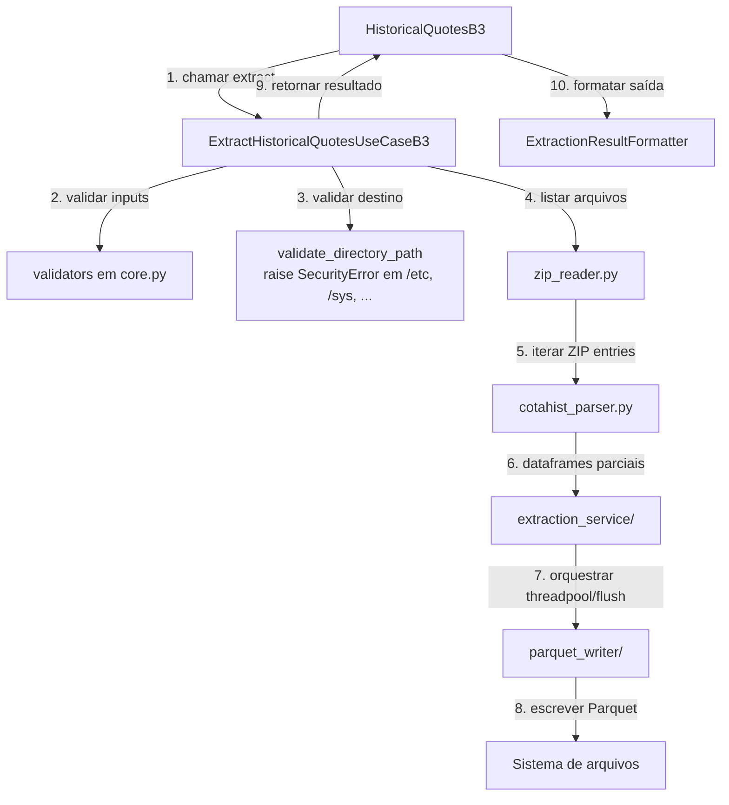

# Arquitetura

Documentação completa da arquitetura do Global-Data-Finance, padrões de design e estrutura do projeto.

---

## Visão Geral

Global-Data-Finance é uma biblioteca Python distribuída via PyPI cuja API pública é deliberadamente estreita — apenas duas classes (`FundamentalStocksDataCVM` e `HistoricalQuotesB3`). Internamente, cada fonte de dados é implementada em um diretório próprio com **layout plano de módulos nomeados por papel**.

> **Estado atual.** A refactor `anti-overengineering` (ver `openspec/changes/refactor-anti-overengineering/`) está em curso. CVM já está achatada (`core.py` + `client.py` + `http.py` + `extract.py` + helpers de download); B3 está parcialmente achatada — os subpacotes `domain/`/`application/`/`infra/` foram removidos, mas o conteúdo virou múltiplos módulos por papel em vez de um único `core.py` consolidado. Os caminhos abaixo refletem o disco hoje, não a forma final pretendida.

Esta abordagem privilegia:

- ✅ **Leitura**: poucos arquivos com nomes claros (CVM: `core.py`, `client.py`, `http.py`, `extract.py`, `errors.py`; B3: módulos por papel — `client.py`, `assets.py`, `models.py`, `years.py`, `processing.py`, `filesystem.py`, `errors.py`, mais subpacotes pesados)
- ✅ **Manutenibilidade**: zero cerimônia de camadas Clean Architecture para uma lib com 1 implementação por papel
- ✅ **Extensibilidade**: adicionar nova fonte = adicionar nova pasta-irmã com o mesmo conjunto plano de módulos
- ✅ **Testabilidade**: duck typing direto (sem ABCs sem polimorfismo real); tests mockam adapters concretos

---

## Estrutura do Projeto

```text
globaldatafinance/
├── src/globaldatafinance/
│   ├── __init__.py                  # re-exporta a API pública
│   ├── application/                 # FACADE PÚBLICO (top-level)
│   │   ├── b3_docs/
│   │   │   ├── historical_quotes.py            # HistoricalQuotesB3
│   │   │   ├── extraction_result_formatter.py
│   │   │   └── result_formatters/
│   │   └── cvm_docs/
│   │       ├── fundamental_stocks_data.py      # FundamentalStocksDataCVM
│   │       └── download_result_formatter.py
│   ├── brazil/                      # IMPLEMENTAÇÕES POR FONTE
│   │   ├── b3_data/
│   │   │   └── historical_quotes/   # módulos por papel + subpacotes pesados
│   │   │       ├── client.py                  # ExtractHistoricalQuotesUseCaseB3 + funções de orquestração
│   │   │       ├── assets.py                  # AvailableAssetsServiceB3 (validação + TPMERC mapping)
│   │   │       ├── models.py                  # DocsToExtractorB3 (dataclass)
│   │   │       ├── years.py                   # YearRangeB3 (value object + validators)
│   │   │       ├── processing.py              # ProcessingModeEnumB3, _ProcessingModeConfig
│   │   │       ├── filesystem.py              # FileSystemServiceB3.validate_directory_path
│   │   │       ├── errors.py                  # exceções específicas da fonte
│   │   │       ├── zip_reader.py              # leitura de COTAHIST ZIP
│   │   │       ├── cotahist_parser.py         # parser posicional (preservado isolado)
│   │   │       ├── parquet_writer/            # subpacote: writer Parquet
│   │   │       └── extraction_service/        # subpacote: orquestração streaming/threadpool
│   │   └── cvm/
│   │       └── fundamental_stocks_data/   # layout achatado (5 + 2 helpers)
│   │           ├── core.py                    # AvailableDocsCVM, AvailableYearsCVM, DictZipsToDownloadCVM, DownloadResultCVM
│   │           ├── client.py                  # DownloadDocumentsUseCaseCVM, GenerateUrlsUseCaseCVM, VerifyPathsUseCasesCVM
│   │           ├── http.py                    # AsyncDownloadAdapterCVM (httpx async + retry + integrity)
│   │           ├── extract.py                 # ParquetExtractorAdapterCVM
│   │           ├── download_validation.py     # validate_downloaded_file, validate_parquet_files, find_parquet_files
│   │           ├── download_extraction.py     # extract_downloaded_file (orquestra adapter + validation)
│   │           └── errors.py                  # exceções específicas da fonte
│   ├── core/                        # utilidades de infraestrutura
│   ├── macro_infra/                 # adapters genéricos compartilhados
│   └── macro_exceptions/            # exceções de base do projeto
├── tests/                           # pytest, mirror por fonte
├── docs/                            # MkDocs
└── pyproject.toml
```

Pastas pendentes de promoção (`brazil/b3_data/{Dados_B3_Acoes, Dados_B3_FIIs, Opcoes_B3}`, `brazil/gerais/`, `brazil/app_geral.py`) permanecem no diretório atual: estão fora do escopo do padrão plano e serão promovidas por changes OpenSpec futuras dedicadas a cada fonte.

---

## Padrão de módulos por fonte

Cada `brazil/<país>/<fonte>/` segue o mesmo conjunto de **papéis**. O mapeamento papel ↔ arquivo é fixo na CVM (um arquivo por papel) e mais granular na B3 (papéis "dados puros" e "validação" foram quebrados em módulos por tópico para evitar um único `core.py` gigante). Adicionar uma nova fonte pode seguir qualquer dos dois caminhos — o critério é legibilidade.

| Papel                       | CVM                                            | B3                                                                                     |
| --------------------------- | ---------------------------------------------- | -------------------------------------------------------------------------------------- |
| Dados puros (types, enums)  | `core.py`                                      | `models.py` + `years.py` + `processing.py`                                             |
| Validação / domain services | `core.py` (`AvailableDocsCVM.validate_*`)      | `assets.py` (`AvailableAssetsServiceB3`) + `filesystem.py` (`validate_directory_path`) |
| Orquestração / use cases    | `client.py`                                    | `client.py`                                                                            |
| HTTP / download             | `http.py` (`AsyncDownloadAdapterCVM`)          | (no `zip_reader.py` + `extraction_service/`; não há download HTTP)                     |
| Extração / escrita Parquet  | `extract.py` (`ParquetExtractorAdapterCVM`)    | `parquet_writer/` (subpacote)                                                          |
| Parser de formato           | —                                              | `cotahist_parser.py`                                                                   |
| Helpers de validação        | `download_validation.py`, `download_extraction.py` | embutidos em `filesystem.py` / `client.py`                                         |
| Exceções                    | `errors.py`                                    | `errors.py`                                                                            |

Funções/classes auxiliares são internas ao módulo a menos que sejam usadas em outro arquivo — o ponto de extensibilidade real é a fonte, não o "tipo de objeto".

> **Por que B3 não tem `core.py` consolidado.** A refactor anti-overengineering deixou o conteúdo de B3 em módulos por tópico (`assets.py`, `models.py`, `years.py`, `processing.py`, `filesystem.py`) em vez de um único `core.py` porque cada um deles já tinha massa crítica (~100–300 linhas) e diferentes consumidores. Consolidar agora trocaria 5 arquivos médios por 1 arquivo enorme — exatamente o oposto da intenção da refactor.

---

## Camadas observáveis

A arquitetura tem **duas camadas explícitas** (em vez das 4 da Clean Architecture original):

### 1. Facade público (`application/`)

**Responsabilidade**: superfície semver-relevante para usuários da biblioteca.

```python
# src/globaldatafinance/application/cvm_docs/fundamental_stocks_data.py
from ...brazil.cvm.fundamental_stocks_data import (
    AsyncDownloadAdapterCVM,
    DownloadDocumentsUseCaseCVM,
    DownloadResultCVM,
    ParquetExtractorAdapterCVM,
    # ...
)

class FundamentalStocksDataCVM:
    def __init__(self):
        self.download_adapter = AsyncDownloadAdapterCVM(...)
        self.__download_use_case = DownloadDocumentsUseCaseCVM(self.download_adapter)

    def download(self, destination_path, list_docs=None, initial_year=None, last_year=None):
        result = self.__download_use_case.execute(
            destination_path=destination_path,
            list_docs=list_docs,
            initial_year=initial_year,
            last_year=last_year,
        )
        self.__result_formatter.print_result(result)
        return result
```

O facade importa **diretamente** dos módulos planos da fonte (sem passar por re-exports intermediários em `brazil/__init__.py`).

### 2. Implementação por fonte (`brazil/<país>/<fonte>/`)

Cada fonte é autocontida em ~5–8 arquivos. Exemplo CVM:

```python
# src/globaldatafinance/brazil/cvm/fundamental_stocks_data/core.py
class AvailableDocsCVM:
    DOCS_MAPPING = {
        'DFP': 'Demonstração Financeira Padronizada',
        'ITR': 'Informação Trimestral',
        # ...
    }

    def validate_docs_name(self, doc_name: str) -> None:
        if doc_name not in self.DOCS_MAPPING:
            raise InvalidDocName(f'Invalid document: {doc_name}')
```

```python
# src/globaldatafinance/brazil/cvm/fundamental_stocks_data/client.py
class DownloadDocumentsUseCaseCVM:
    def __init__(self, repository: AsyncDownloadAdapterCVM) -> None:
        self.__repository: AsyncDownloadAdapterCVM = repository
        # ...

    def execute(self, destination_path, list_docs=None, initial_year=None, last_year=None) -> DownloadResultCVM:
        start_time = time.time()
        # ... orquestração ...
        result = self.__repository.download_docs(tasks)
        result.elapsed_time = time.time() - start_time
        return result
```

```python
# src/globaldatafinance/brazil/cvm/fundamental_stocks_data/http.py
class AsyncDownloadAdapterCVM:
    def download_docs(self, tasks) -> DownloadResultCVM:
        # implementação concreta com httpx async, retry, integrity check
        ...
```

Note que `AsyncDownloadAdapterCVM` **não** herda de ABC — quando havia 1 implementação, o ABC só adicionava cerimônia. Tests fazem duck typing com classe stub simples (ver "Testes" mais abaixo).

---

## Padrões de design

### Função (ou classe leve) por operação em `client.py`

A maioria das operações é função de módulo ou classe com 1 método público, chamada diretamente pelo facade — sem `execute(...)` wrappers desnecessários e sem ABCs de implementação única. Classes existem apenas quando há **estado real reutilizável**: por exemplo, `ExtractHistoricalQuotesUseCaseB3` segura `zip_reader + parser + writer + processing_mode` entre chamadas e por isso permanece como classe.

```python
# Função simples em client.py
def generate_range_years(initial_year: int | None, last_year: int | None) -> list[int]:
    ...

# Classe com estado real
class ExtractHistoricalQuotesUseCaseB3:
    def __init__(self, zip_reader, parser, writer, processing_mode):
        ...
    def execute(self, paths_of_docs, docs_to_extract):
        ...
```

### Adapters concretos, sem indireção por ABC

`AsyncDownloadAdapterCVM`, `ParquetExtractorAdapterCVM`, `AsyncDownloadAdapterB3` (etc.) são importados e construídos diretamente. A indireção `DownloadDocsCVMRepositoryCVM` / `FileExtractorRepositoryCVM` foi removida quando se confirmou que havia 1 única implementação concreta — quando uma segunda implementação aparecer (`WgetDownloadAdapter`, etc.), extrair um `Protocol` é trivial e custa 1 commit.

### Result objects

Operações que podem falhar parcialmente retornam um dataclass de resultado com sucessos e erros explícitos, em vez de `raise` em falhas parciais.

```python
@dataclass
class DownloadResultCVM:
    success_count_downloads: int
    error_count_downloads: int
    successful_downloads: list[str]
    failed_downloads: dict[str, str]
    elapsed_time: float

    def has_errors(self) -> bool:
        return self.error_count_downloads > 0
```

### Value objects

Tipos imutáveis em `core.py` que encapsulam validação e construção (`DictZipsToDownloadCVM`, `DocsToExtractorB3`, etc.).

### Separação de apresentação

Saída de console/log de apresentação fica em módulos `*_formatter.py` dentro de `application/`. Código de `client.py` permanece I/O-free (exceto pelas chamadas a adapters concretos).

### Defesa de path-traversal preservada como contrato

`VerifyPathsUseCasesCVM` (CVM, em `client.py`) e o helper de validação de diretório (B3, em `core.py`) levantam `SecurityError` antes de qualquer `mkdir`, bloqueando escrita em `/etc /sys /proc /dev /boot /root`. Esses helpers fazem parte do contrato observável de `FundamentalStocksDataCVM.download(destination_path=...)` e `HistoricalQuotesB3.extract(path_of_docs=...)` — devem permanecer bit-idênticos em qualquer refactor que mova o código.

---

## Fluxo de dados

### Download de documentos CVM


```mermaid
graph TD
    A[FundamentalStocksDataCVM] -->|1. chamar download| B[DownloadDocumentsUseCaseCVM]
    B -->|2. validar inputs| C[AvailableDocsCVM / AvailableYearsCVM em core.py]
    B -->|3. gerar URLs| D[GenerateUrlsUseCaseCVM em client.py]
    B -->|4. verificar paths| E[VerifyPathsUseCasesCVM<br/>raise SecurityError em /etc, /sys, ...]
    B -->|5. executar download| F[AsyncDownloadAdapterCVM em http.py]
    F -->|6. HTTP requests| G[Servidor CVM]
    F -->|7. integrity check + salvar| H[Sistema de arquivos]
    F -->|8. retornar resultado| B
    B -->|9. retornar resultado| A
    A -->|10. formatar saída| I[DownloadResultFormatter]
```

### Extração de cotações B3


```mermaid
graph TD
    A[HistoricalQuotesB3] -->|1. chamar extract| B[ExtractHistoricalQuotesUseCaseB3]
    B -->|2. validar inputs| C[validators em core.py]
    B -->|3. validar destino| D[validate_directory_path<br/>raise SecurityError em /etc, /sys, ...]
    B -->|4. listar arquivos| E[zip_reader.py]
    E -->|5. iterar ZIP entries| F[cotahist_parser.py]
    F -->|6. dataframes parciais| G[extraction_service/]
    G -->|7. orquestrar threadpool/flush| H[parquet_writer/]
    H -->|8. escrever Parquet| I[Sistema de arquivos]
    B -->|9. retornar resultado| A
    A -->|10. formatar saída| J[ExtractionResultFormatter]
```

---

## Como adicionar uma nova fonte

Para uma nova fonte (ex.: SEC dos EUA), crie uma nova pasta-irmã com módulos nomeados por papel. Para fontes pequenas, o conjunto mínimo da CVM funciona bem; para fontes maiores, espelhe a granularidade de B3 e separe os tópicos antes que o `core.py` cresça demais.

```text
src/globaldatafinance/usa/sec/fundamental_data/
├── core.py        # entidades, value objects, validadores  (consolide se ≤ ~300 linhas)
├── client.py      # use cases / orquestradores
├── http.py        # adapter HTTP concreto
├── extract.py     # adapter de extração concreto (se aplicável)
└── errors.py      # exceções específicas
```

Em seguida:

1. **Re-export interno**: adicione `__init__.py` na pasta da fonte (ou deixe vazio se não houver consumidores internos).
2. **Facade público**: crie `src/globaldatafinance/application/sec_docs/fundamental_data.py` com uma classe `FundamentalDataSEC` que importa diretamente dos módulos planos:

   ```python
   from ...usa.sec.fundamental_data import (
       DownloadAdapterSEC,
       DownloadDocumentsUseCaseSEC,
       # ...
   )
   ```

3. **API pública**: re-exporte a nova classe em `src/globaldatafinance/__init__.py` e `src/globaldatafinance/application/__init__.py`. Trate como adição **semver-relevante**.
4. **Testes**: crie `tests/usa/sec/fundamental_data/` espelhando módulos por tópico (não por camada). Tests devem importar dos módulos planos.
5. **Docs**: atualize `AGENTS.md` (Repository Map / Architecture Map) e este arquivo. Adicione referência em `docs/reference/`.

---

## Testes

A árvore de testes espelha as fontes:

```text
tests/
├── brazil/
│   ├── cvm/fundamental_stocks_data/
│   │   ├── application/use_cases/    # tests por tópico (organizacional, não camada)
│   │   ├── domain/                   # tests de value objects, validators (core.py)
│   │   ├── infra/adapters/           # tests de adapters concretos (http.py, extract.py)
│   │   ├── exceptions/               # tests das exceções (errors.py)
│   │   └── integration/              # tests integration-marker
│   └── b3_data/historical_quotes/
│       ├── application/              # tests de orquestração (client.py)
│       ├── domain/                   # tests por tópico
│       │   ├── entities/             # models.py
│       │   ├── exceptions/           # errors.py
│       │   ├── services/             # assets.py, filesystem.py
│       │   └── value_objects/        # years.py, processing.py
│       ├── infra/                    # tests de parser, writer, extraction_service, zip_reader
│       └── integration/              # tests integration-marker
└── application/
    ├── cvm_docs/   # tests do facade público
    └── b3_docs/
        └── result_formatters/
```

Os subdiretórios dentro de cada fonte são **organizacionais** (agrupam por tópico para legibilidade), não arquiteturais — qualquer test importa dos módulos via `from globaldatafinance.brazil.cvm.fundamental_stocks_data.client import ...`. Os nomes `domain/` `infra/` `application/` são legado pré-refactor e seguem em disco; a refactor `anti-overengineering` planeja reorganizá-los.

### Mocking sem ABC

Como adapters são concretos, tests substituem dependências via:

- **Stub duck-typed**: classe sem herança, expondo apenas os métodos usados.
- **`monkeypatch.setattr`**: patcheia o método do adapter real.
- **`httpx.MockTransport`**: para tests do adapter HTTP que precisam respostas determinísticas sem rede.

Exemplo (duck typing):

```python
class MockRepository:
    def download_docs(self, tasks):
        return DownloadResultCVM(
            success_count_downloads=2,
            error_count_downloads=0,
            successful_downloads=['DFP_2023', 'ITR_2023'],
            failed_downloads={},
        )

use_case = DownloadDocumentsUseCaseCVM(MockRepository())
result = use_case.execute(destination_path='/tmp/cvm')
assert result.success_count_downloads == 2
```

Coverage é validado por capability: `tests/brazil/<source>/` + `tests/application/<facade>/` cobrem cada fonte como unidade isolada.

---

## Próximos Passos

- 📖 **[Referência da API](api-reference.md)** — Documentação completa da API
- 🤝 **[Como Contribuir](contributing.md)** — Guia para contribuidores
- 🧪 **[Testes](testing.md)** — Como escrever e executar testes
- 🔧 **[Uso Avançado](advanced-usage.md)** — Customização e extensões
